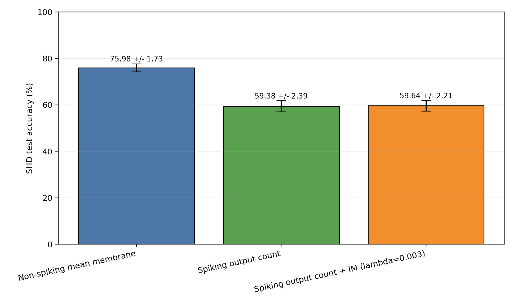
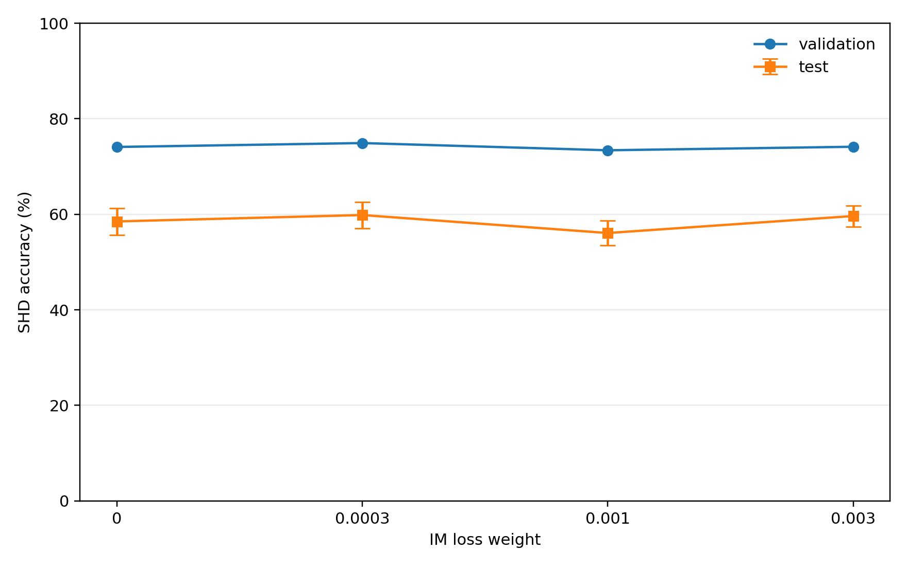
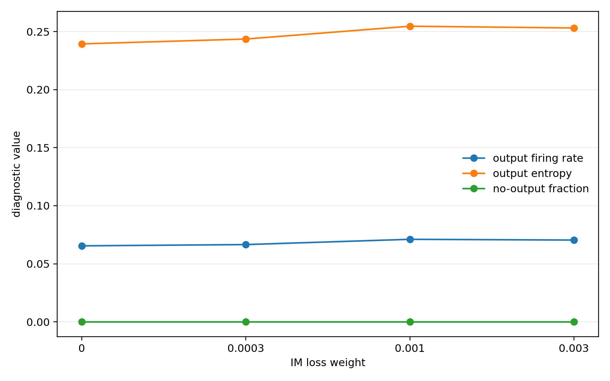
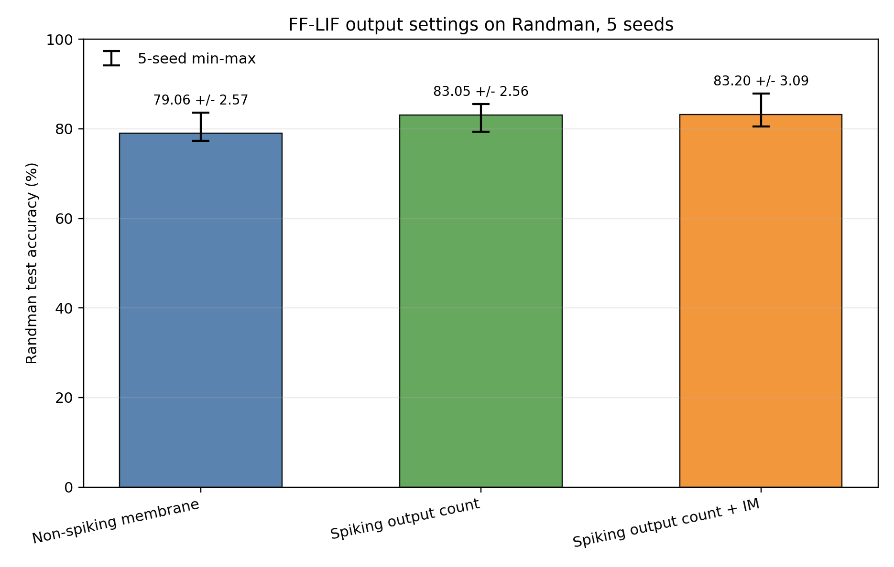
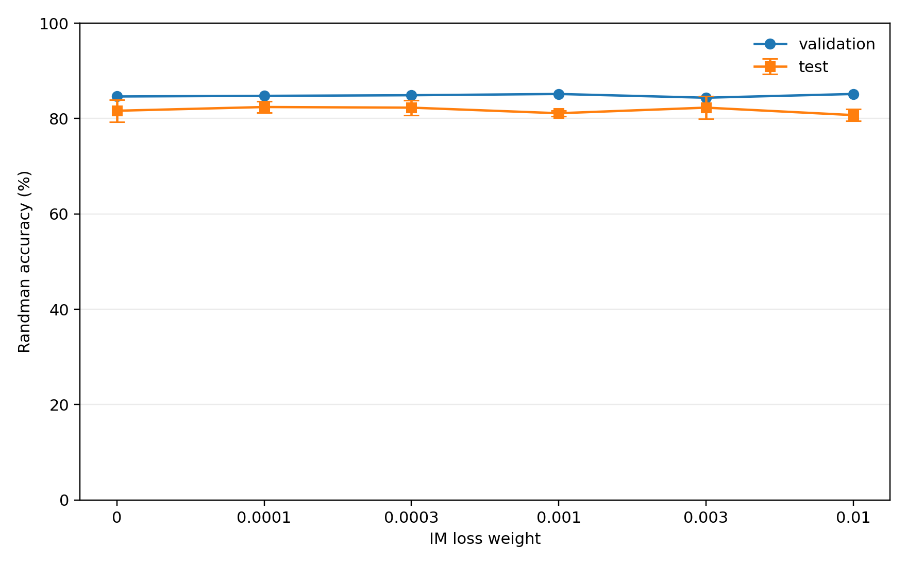
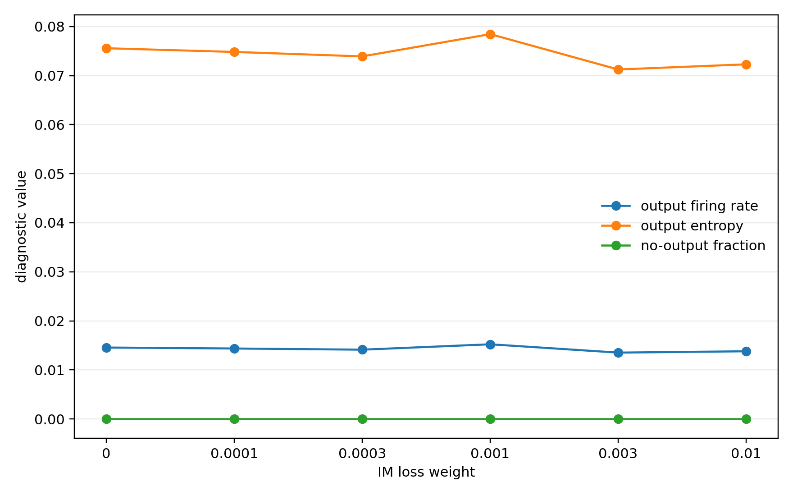

# Temporal IM-Loss SNN Technical Note

## Question And Hypothesis

This project asks whether a spiking output layer trained with an output-layer information-maximization (IM) regularizer can approach the performance of a standard non-spiking membrane-potential readout in temporal SNN classification.

Hypothesis:

- A spiking output layer can lose task-relevant graded evidence because the final class evidence is quantized into binary spikes.
- An output-layer IM regularizer should increase the information carried by output spikes, measured through output firing rate, entropy, and correct-vs-competing spike counts.
- IM should reduce the performance gap to a non-spiking membrane readout, but the effect should depend on the IM coefficient lambda. Too much IM can force non-discriminative spikes and hurt accuracy.

The final results support the hypothesis qualitatively on SHD after correcting the non-spiking readout confound, but not on Randman, where spike-count output is already strong.

## Implementation Summary

The code uses PyTorch and trains small temporal SNN classifiers with backpropagation through time and a fixed fast-sigmoid surrogate gradient.

Primary model:

```text
time-first spikes -> Linear -> LIF hidden layer -> output/readout layer
```

The main classifier is `FeedForwardLIFClassifier` in `models/temporal_snn.py`.

Supported output/readout modes:

- `output_mode="nonspiking"`: the output layer keeps continuous membrane traces and converts them into class logits through a membrane readout.
- `output_mode="spiking_count"`: the output layer is also spiking; class logits are spike counts accumulated over time.

Supported non-spiking membrane readouts:

- `max_membrane`: maximum class membrane value over time.
- `mean_membrane`: mean class membrane value over time.
- `last_membrane`: final class membrane value.

The main initial plan used max membrane as the default non-spiking readout. Later SHD sensitivity analysis showed that mean membrane is a much stronger non-spiking baseline for SHD.

## Data

### Randman

`data/randman.py` implements a deterministic random-manifold temporal spike dataset. Each class has fixed random projections from a low-dimensional latent variable into input-neuron spike times.

Default Randman settings:

| Parameter | Value |
|---|---:|
| Input units | 128 |
| Classes | 10 |
| Timesteps | 100 |
| Manifold dimension | 2 |
| Spike probability | 0.35 |
| Noise rate | 0.001 |
| Jitter std | 1.0 |
| Train/val/test samples | 1024 / 256 / 256 |

### SHD

`data/shd.py` loads the Spiking Heidelberg Digits HDF5 files and bins event lists into dense time-first tensors.

```text
spikes:  [T, B, N]
labels:  [B]
lengths: [B]
```

Default SHD settings:

| Parameter | Value |
|---|---:|
| Input units | 700 |
| Classes | 20 |
| dt | 0.005 s |
| t_stop | 1.4 s |
| Timesteps | 280 |
| Input mode | binary |
| Validation split | 10% of train split |

## Training Setup

The Colab experiments used:

| Setting | Value |
|---|---:|
| Python | 3.12.13 |
| PyTorch | 2.11.0+cu128 |
| GPU | Tesla T4 |
| Epochs | 20 |
| Batch size | 64 |
| Hidden size | 256 |
| Hidden layers | 1 |
| Optimizer | AdamW |
| Learning rate | 0.001 |
| Weight decay | 0.0001 |
| Threshold | 1.0 |
| Hidden beta | 0.95 |
| Readout beta | 0.95 |
| Surrogate slope | 25.0 |

Each run saves:

- `config.json`
- `metrics.csv`
- `best.pth`
- `last.pth`
- `metrics.json`

`metrics.csv` stores per-epoch train/validation loss, accuracy, IM loss, learning rate, and activity diagnostics. `metrics.json` stores final test metrics evaluated from the best validation checkpoint.

## IM Loss Variants

Two lightweight IM-style regularizers are implemented.

Rate IM:

```text
penalize deviation of spike rate from target rate
```

Threshold IM:

```text
penalize deviation of mean membrane potential from threshold
```

For the main output-layer IM experiments, hidden-layer IM was disabled:

```bash
--use_im_loss --im_include_output --im_hidden_weight 0.0 --im_output_weight 1.0
```

The implementation does not include Evolutionary Surrogate Gradients (ESG). The surrogate gradient is fixed during training. This makes the project a focused test of output-layer IM-style regularization, not a full reproduction of the original IM-Loss paper.

## Metrics

Primary metric:

- Test classification accuracy.

Secondary task metric:

- Cross-entropy loss.

Spike/output diagnostics:

- Output firing rate.
- Output Bernoulli entropy.
- No-output-spike fraction.
- Total output spike count per sample.
- Correct-class output spike count.
- Max competing-class output spike count.
- Fraction where correct output count exceeds the strongest competitor.

These metrics directly test whether IM changes output spike activity in the direction predicted by the hypothesis.

## Experiments

### Experiment 1: Randman Three-Condition Comparison

Conditions, 5 seeds:

1. Non-spiking max-membrane readout.
2. Spiking output count.
3. Spiking output count + rate IM with lambda `0.001`.

Final saved results:

| Condition | Seeds | Test accuracy (%) |
|---|---:|---:|
| Non-spiking max membrane | 5 | 79.06 +/- 2.57 |
| Spiking output count | 5 | 83.05 +/- 2.56 |
| Spiking output count + rate IM, lambda 0.001 | 5 | 83.20 +/- 3.09 |

Interpretation:

- Randman does not show the expected spiking-output penalty.
- Spike-count output is stronger than the max-membrane baseline by about 3.98 percentage points on average.
- Default IM gives only a tiny gain over naive spiking output, about 0.16 percentage points.
- This suggests that Randman spike counts already preserve enough temporal class evidence for this architecture.

Diagnostics:

| Condition | Firing rate | Entropy | Output count | Correct count | Competing count |
|---|---:|---:|---:|---:|---:|
| Spiking count | 0.0138 | 0.0725 | 13.84 | 5.88 | 3.08 |
| Spiking count + IM | 0.0142 | 0.0739 | 14.17 | 5.93 | 3.16 |

IM slightly increases output activity and entropy, but the change is small.

### Experiment 2: Randman Mean-Membrane Sensitivity Check

A later sensitivity check replaced non-spiking max membrane with non-spiking mean membrane.

| Condition | Seeds | Test accuracy (%) |
|---|---:|---:|
| Non-spiking mean membrane | 5 | 52.81 +/- 2.30 |
| Spiking output count | 5 | 83.05 +/- 2.56 |
| Spiking output count + rate IM, lambda 0.001 | 5 | 83.20 +/- 3.09 |

For Randman, mean membrane is much worse than max membrane. Therefore the original Randman max-membrane baseline remains the more meaningful non-spiking baseline.

### Experiment 3: Randman Lambda Sweeps

Rate-IM lambda sweep, 3 seeds:

| Lambda | Validation accuracy (%) | Test accuracy (%) | Output firing | Entropy |
|---:|---:|---:|---:|---:|
| 0.0 | 84.64 | 81.64 +/- 2.34 | 0.0146 | 0.0756 |
| 0.0001 | 84.77 | 82.42 +/- 1.17 | 0.0144 | 0.0748 |
| 0.0003 | 84.90 | 82.29 +/- 1.58 | 0.0141 | 0.0739 |
| 0.001 | 85.16 | 81.12 +/- 0.60 | 0.0152 | 0.0784 |
| 0.003 | 84.38 | 82.29 +/- 2.39 | 0.0135 | 0.0712 |
| 0.01 | 85.16 | 80.73 +/- 1.26 | 0.0138 | 0.0723 |

Threshold-IM lambda sweep, 3 seeds:

| Lambda | Validation accuracy (%) | Test accuracy (%) | Output firing | Entropy |
|---:|---:|---:|---:|---:|
| 0.0 | 84.64 | 81.64 +/- 2.34 | 0.0146 | 0.0756 |
| 0.0001 | 83.98 | 81.38 +/- 0.81 | 0.0145 | 0.0754 |
| 0.0003 | 84.51 | 82.29 +/- 2.66 | 0.0137 | 0.0721 |
| 0.001 | 82.55 | 80.08 +/- 2.71 | 0.0150 | 0.0770 |
| 0.003 | 80.99 | 77.34 +/- 3.47 | 0.0163 | 0.0830 |
| 0.01 | 76.43 | 77.21 +/- 2.26 | 0.0189 | 0.0932 |

Interpretation:

- Randman shows weak lambda effects.
- Very large threshold IM increases output firing and entropy but hurts accuracy.
- This supports the prediction that excessive IM can produce less discriminative output activity.

### Experiment 4: SHD Three-Condition Comparison With Max Membrane

Initial SHD comparison, 5 seeds:

| Condition | Seeds | Test accuracy (%) |
|---|---:|---:|
| Non-spiking max membrane | 5 | 38.46 +/- 2.99 |
| Spiking output count | 5 | 59.38 +/- 2.39 |
| Spiking output count + rate IM, lambda 0.001 | 5 | 57.74 +/- 3.01 |

This result looked surprising because the non-spiking baseline was much weaker than the spiking output. The later readout sensitivity check showed that this was a readout confound: max membrane is a poor non-spiking readout for SHD in this setup.

### Experiment 5: SHD Mean-Membrane Sensitivity Check

Non-spiking SHD was rerun with mean membrane readout, 5 seeds:

| Condition | Seeds | Test accuracy (%) |
|---|---:|---:|
| Non-spiking mean membrane | 5 | 75.98 +/- 1.73 |
| Spiking output count | 5 | 59.38 +/- 2.39 |
| Spiking output count + rate IM, lambda 0.001 | 5 | 57.74 +/- 3.01 |

This is the strongest evidence for the main project hypothesis. With a better non-spiking readout, SHD shows a large gap between non-spiking membrane output and spiking output count.

### Experiment 6: SHD Rate-IM Lambda Sweep

SHD rate-IM lambda sweep, 3 seeds:

| Lambda | Validation accuracy (%) | Test accuracy (%) | Output firing | Entropy |
|---:|---:|---:|---:|---:|
| 0.0 | 74.10 | 58.51 +/- 2.81 | 0.0654 | 0.2394 |
| 0.0003 | 74.92 | 59.85 +/- 2.76 | 0.0665 | 0.2436 |
| 0.001 | 73.41 | 56.08 +/- 2.57 | 0.0711 | 0.2546 |
| 0.003 | 74.14 | 59.64 +/- 2.21 | 0.0704 | 0.2531 |

Final selected SHD comparison used lambda `0.003`:

| Condition | Seeds | Test accuracy (%) |
|---|---:|---:|
| Non-spiking mean membrane | 5 | 75.98 +/- 1.73 |
| Spiking output count | 5 | 59.38 +/- 2.39 |
| Spiking output count + rate IM, lambda 0.003 | 3 | 59.64 +/- 2.21 |

Interpretation:

- SHD supports the expected non-spiking vs spiking gap when mean membrane is used.
- Default IM with lambda `0.001` hurts compared to naive spiking output.
- Tuned IM with lambda `0.003` gives a small improvement over naive spiking output in the 3-seed sweep.
- The improvement is small compared to the gap to non-spiking mean membrane.

## Figures

Final figure files are stored in `im_snn_runs/summary/`. The figures below are the recommended evidence package for the final presentation and repository review.

### Final SHD Comparison



This is the main final comparison. It uses the stronger SHD non-spiking mean-membrane baseline, the naive spiking output count model, and the tuned rate-IM condition with lambda `0.003`.

### SHD Lambda Sensitivity And Diagnostics





These plots show how the SHD spiking-output model changes as the output-layer rate-IM coefficient changes. They are used to justify why lambda tuning is necessary and why IM is not uniformly beneficial.

### Randman Comparison And Diagnostics







These plots show that Randman behaves differently from SHD: spike-count output is already strong, and IM gives only small changes in accuracy and output activity.

The corresponding CSV and JSON files in `im_snn_runs/summary/` store the numeric values used to generate the plots.
## Conclusions

The experiments answer the project question with a qualified result.

1. On SHD, a strong non-spiking membrane readout is clearly better than spiking output counts. This supports the idea that output spikes can lose useful graded evidence.
2. Output-layer IM can slightly improve spiking output after lambda tuning, but it does not close the SHD gap to the non-spiking mean-membrane baseline.
3. On Randman, spiking output count is already competitive or better than the non-spiking max-membrane baseline. This shows that the size and direction of the spiking-output gap depend on the task and readout.
4. IM changes output activity statistics in the expected direction, but higher activity or entropy is not automatically better for classification.
5. Lambda sensitivity is important: too much IM can hurt task performance by encouraging output activity that is not class-discriminative.

## Limitations

- The implementation uses a fixed fast-sigmoid surrogate gradient, not the Evolutionary Surrogate Gradient method from the IM-Loss paper.
- The implemented IM variants are simplified rate and threshold regularizers.
- The final SHD tuned-IM comparison uses 3 seeds for lambda `0.003`, while the mean-membrane and naive spiking comparisons use 5 seeds.
- SHD was used as a stretch benchmark; runtime limited broader sweeps.
- Hidden-layer IM, hidden-plus-output IM, recurrent architectures, and timestep sensitivity were not fully explored.
- The Randman and SHD results differ, so conclusions should not be overgeneralized to all temporal SNN tasks.

## Future Work

Concrete next steps:

- Repeat SHD tuned IM with 5 seeds for lambda `0.003` and optionally lambda `0.0003`.
- Add hidden-only and hidden-plus-output IM ablations.
- Tune `im_target_rate` together with lambda.
- Compare mean, max, and last membrane readouts systematically on both datasets.
- Implement ESG or another evolving surrogate-gradient schedule to test whether optimization improvements from the original paper change the output-layer result.
- Add timestep/readout-window sweeps to test whether IM helps more when output spike counts are short or sparse.

## Reproducibility

The notebook `notebooks/colab_run_experiments.ipynb` contains the full Colab workflow used to generate the reported results. It installs dependencies, checks CUDA, runs task grids, summarizes CSV/JSON metrics, and writes figures under `im_snn_runs/summary/`.

For command-line reproduction, use:

```bash
python scripts/run_temporal_task.py ff_output_3way 0
python summarize_ff_output_3way.py --dataset Randman --run_root im_snn_runs --output_dir im_snn_runs/summary
python summarize_lambda_sweep.py --dataset Randman --loss_type rate --run_root im_snn_runs --output_dir im_snn_runs/summary
```

Each training run writes its exact config, per-epoch metrics, best checkpoint, last checkpoint, and final test metrics.

